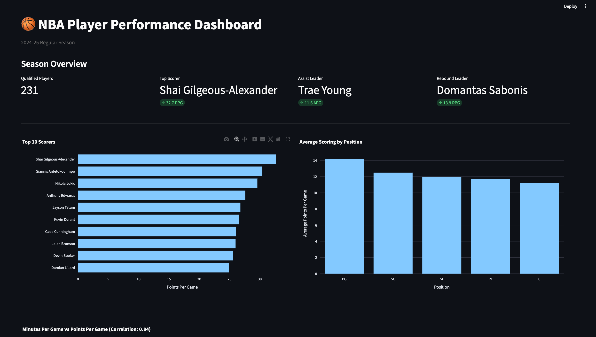
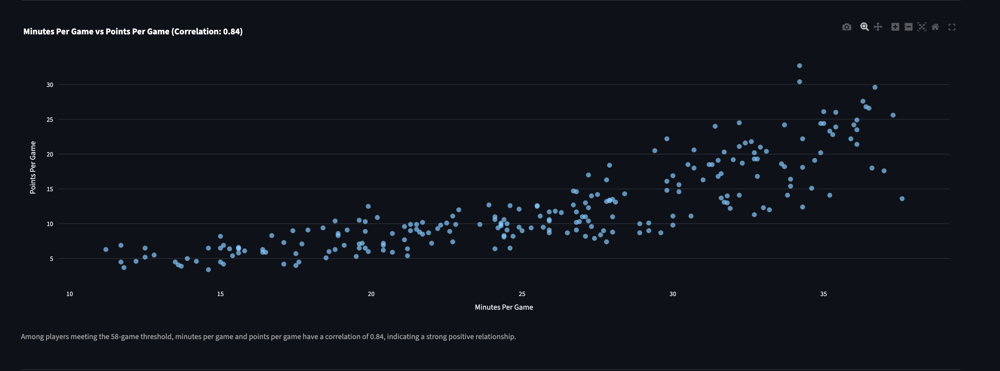
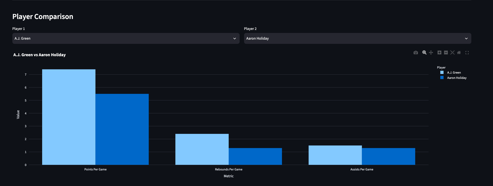

# NBA Player Performance Analytics

An end-to-end data analytics project analyzing player performance during the **2024-25 NBA season**.

I used **Python, pandas, SQL, SQLite, Plotly, and Streamlit** to clean NBA player data, analyze performance trends, and build an interactive dashboard.

---

## Dashboard Preview

The Streamlit dashboard allows users to explore NBA player performance using filters, interactive visualizations, and player comparisons.

### Season Overview

The main dashboard displays key performance leaders and allows users to filter players by team and position.



### Minutes Played vs. Scoring

This interactive scatter plot explores the relationship between minutes played and points scored.



### Player Comparison

Users can select two players and compare their scoring, rebounding, and assist averages.



---

## Project Overview

The goal of this project was to answer several questions about NBA player performance:

- Who were the top scorers, rebounders, and assist leaders?
- Which positions scored the most points on average?
- Is there a relationship between minutes played and scoring?
- How do individual players compare?
- How can the data be explored through an interactive dashboard?

The project follows this workflow:

**Raw Data → Data Cleaning → SQL Database → Analysis → Interactive Dashboard**

---

## Technologies

- **Python** — data processing and analysis
- **pandas** — data cleaning, filtering, and aggregation
- **SQL** — querying player statistics
- **SQLite** — storing the cleaned dataset
- **Matplotlib** — exploratory data visualizations
- **Plotly** — interactive visualizations
- **Streamlit** — interactive dashboard
- **Git & GitHub** — version control
- **Claude Code** — code review and development assistance

---

## Dataset

The dataset contains **2024-25 NBA regular-season per-game player statistics** from Basketball Reference.

The original dataset contains:

- **735 rows**
- **30 columns**
- **569 unique players**

Some players appear multiple times because they were traded during the season.

For example, a traded player may have:

- A combined season row such as `2TM`
- A row for their first team
- A row for their second team

The cleaning process keeps the combined full-season record so that each player appears only once.

**735 raw rows → 569 unique players**

---

## Data Cleaning

Data cleaning is performed in:

`src/clean_data.py`

The script:

1. Loads the raw NBA dataset.
2. Checks for missing values and duplicates.
3. Handles players who played for multiple teams.
4. Keeps one full-season record per player.
5. Renames abbreviated columns to readable names.
6. Saves the cleaned dataset for analysis.

For example:

- `PTS` → `Points_Per_Game`
- `AST` → `Assists_Per_Game`
- `TRB` → `Rebounds_Per_Game`

Missing shooting percentages are kept as missing values rather than changed to zero. A missing percentage can mean that the player never attempted that type of shot, so treating it as 0% would be misleading.

---

## 58-Game Qualification

For player performance comparisons, I included players who appeared in at least **58 games**.

```python
MIN_GAMES = 58
```

This represents roughly 70% of the NBA's 82-game regular season.

The filter helps reduce the effect of small sample sizes when comparing per-game statistics.

The complete cleaned dataset still contains all **569 players**. The 58-game threshold is used only when making performance comparisons.

---

## Python Analysis

`src/analyze_players.py` analyzes the cleaned NBA dataset.

The analysis includes:

- Top 10 scorers
- Top 10 rebounders
- Top 10 assist leaders
- Average scoring by position
- Minutes per game vs. points per game
- Correlation between minutes and scoring

The analysis found a correlation of approximately:

**r = 0.84**

between minutes per game and points per game among qualified players.

This indicates a strong positive relationship: players who play more minutes tend to score more points per game.

---

## SQL Analysis

The cleaned data is loaded into a SQLite database using:

`src/create_database.py`

The SQL queries are located in:

`sql/nba_analysis.sql`

The queries analyze:

- Top scorers
- Top rebounders
- Top assist leaders
- Average scoring by position
- Players averaging at least 20 points per game
- Players averaging at least 20 points and 5 assists
- Average player scoring by team

The SQLite database contains all **569 cleaned players**, while performance-ranking queries use the **58-game qualification threshold**.

---

## Interactive Dashboard

The interactive dashboard is built using **Streamlit and Plotly**.

It includes:

- Qualified player count
- Scoring leader
- Assist leader
- Rebound leader
- Team filter
- Position filter
- Top 10 scorers
- Average scoring by position
- Minutes vs. scoring analysis
- Player-to-player comparison
- Interactive chart tooltips

The dashboard code is located at:

`dashboard/app.py`

### Run the Dashboard

```bash
streamlit run dashboard/app.py
```

---

## Key Findings

### Scoring

**Shai Gilgeous-Alexander** led qualified players with **32.7 points per game**.

### Rebounding

**Domantas Sabonis** averaged **13.9 rebounds per game**, placing him among the league's top rebounders.

### Playmaking

**Trae Young** led qualified players in assists per game.

### Versatility

**Nikola Jokic** ranked among the leaders in scoring, rebounding, and assists.

### Minutes and Scoring

Minutes per game and points per game had a correlation of approximately **0.84** among qualified players, showing a strong positive relationship between playing time and scoring.

---

## Project Structure

```text
nba-performance-analytics/
│
├── data/
│   ├── raw/
│   │   └── nba_player_stats_raw.csv
│   ├── processed/
│   │   └── nba_players_clean.csv
│   └── nba_stats.db
│
├── src/
│   ├── clean_data.py
│   ├── create_database.py
│   └── analyze_players.py
│
├── sql/
│   └── nba_analysis.sql
│
├── dashboard/
│   └── app.py
│
├── screenshots/
│   ├── season overview.png
│   ├── graph.png
│   ├── player comparison.png
│   ├── top_10_scorers.png
│   ├── scoring_by_position.png
│   └── minutes_vs_scoring.png
│
├── requirements.txt
└── README.md
```

---

## How to Run

### 1. Install dependencies

```bash
pip install -r requirements.txt
```

### 2. Clean the data

```bash
python src/clean_data.py
```

### 3. Create the SQLite database

```bash
python src/create_database.py
```

### 4. Run the Python analysis

```bash
python src/analyze_players.py
```

### 5. Launch the dashboard

```bash
streamlit run dashboard/app.py
```

---

## What I Learned

This project helped me practice a complete data analytics workflow, including:

- Cleaning real-world data with pandas
- Handling duplicate player records
- Working with missing data
- Writing SQL queries
- Using filters to make more meaningful comparisons
- Creating data visualizations
- Using correlation to examine relationships
- Building an interactive Streamlit dashboard
- Using Claude Code for code review and debugging
- Organizing and documenting a data project on GitHub

---

## Data Source

Basketball Reference — 2024-25 NBA regular-season per-game player statistics.
